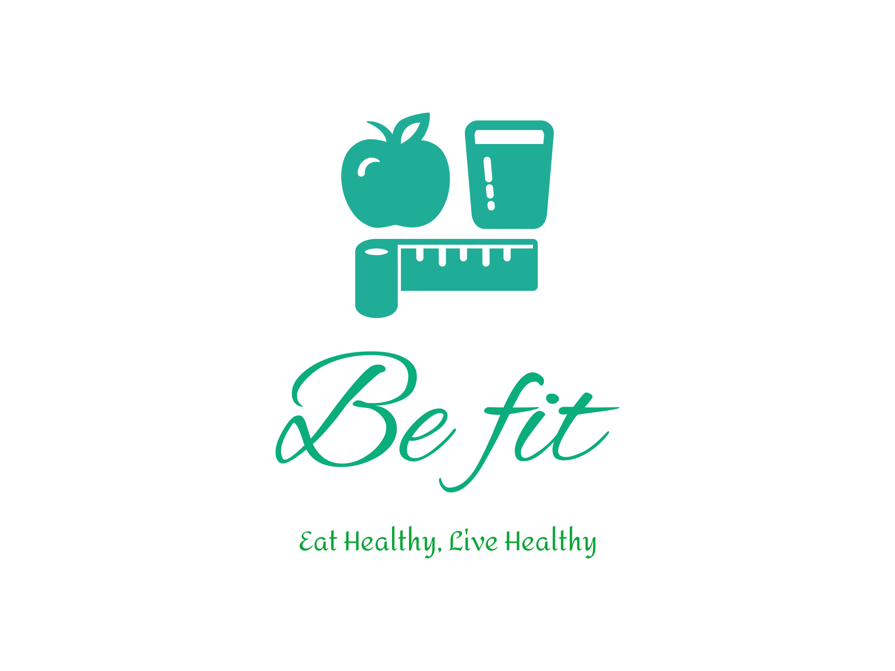
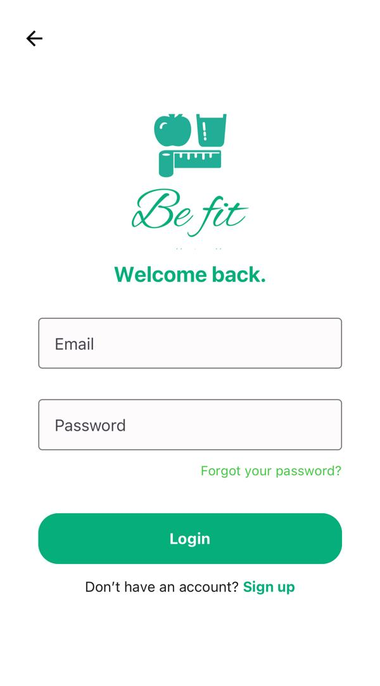
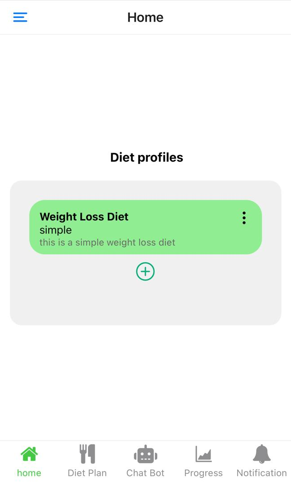
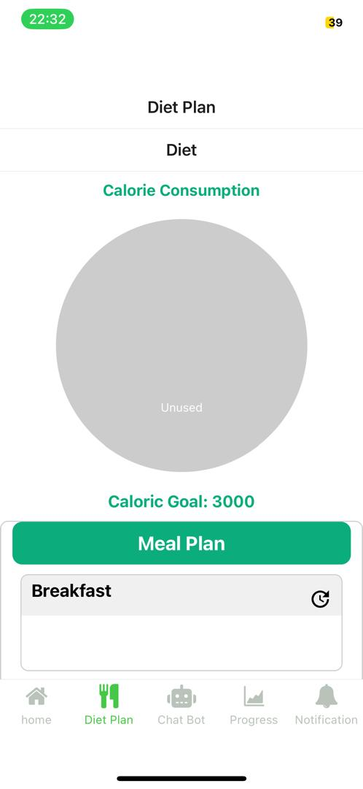
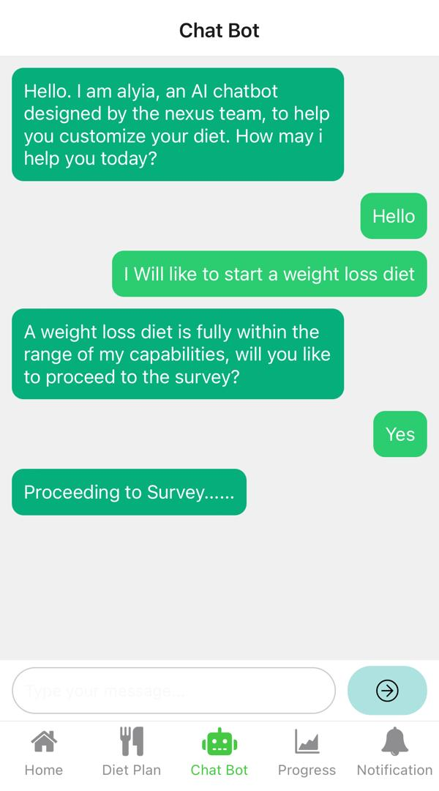
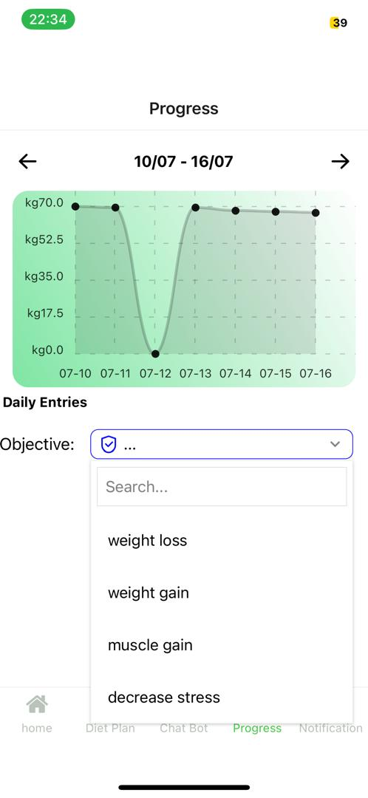
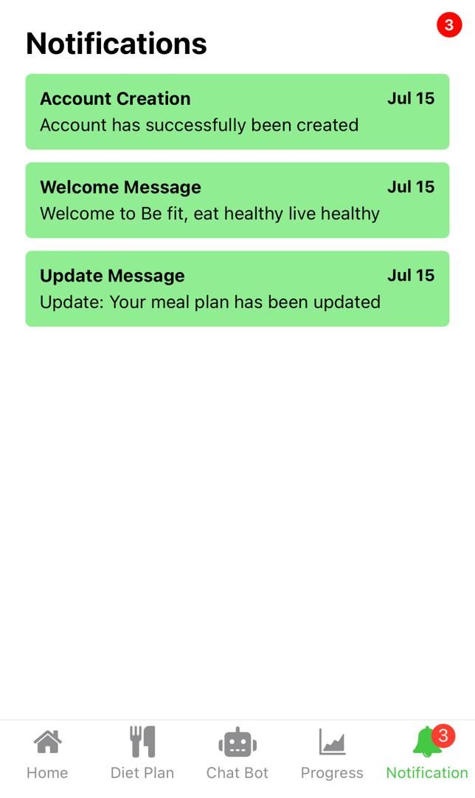
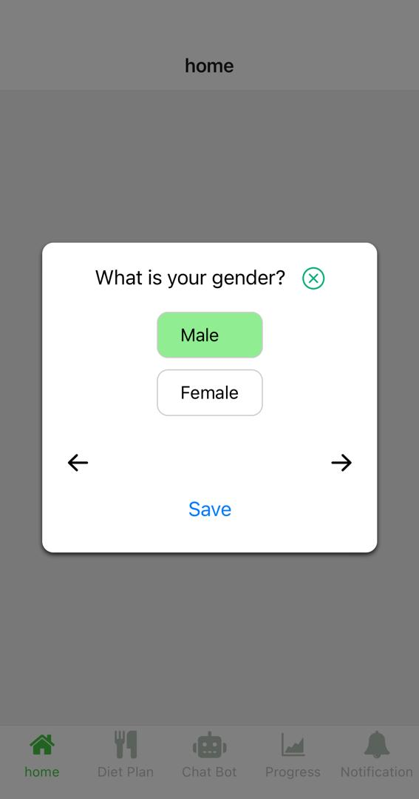
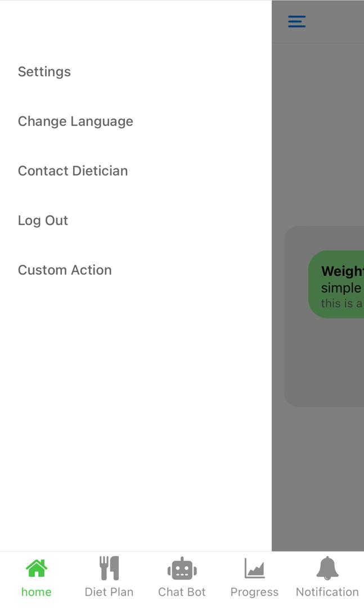

# Android-AI-Diet-Consultant-with-react-native-and-django

## Description
a software that acts as a diet consultant (not a dietician) by offering features for dieting such as survey, meal planning and tracking features.
The focus was on dieting and not on exercising

### Features
SURVEY: this features offers a series of questions that the user can respond to, based on the objective
MEAL PLANNING: this feature permits the user to update their meal plan based on the recommended food items
TRACKING: feature permits the user to track the daily caloire intake based on objective 
CHATBOT: this features permit the user to better describe their dietary requirements through a chatbot. This was achieved through a RASA assistant

### Recommendation engine
This application makes use of ML techniques at the level of the recommendation engine
The recommendation engine recommends food items that best fit a particular objective, using weighted clustering, we assign we

## Visuals

SIMULATION
<video width="640" height="480" controls>
  <source src="gif/VID-20240726-WA0006.mp4" type="video/mp4">
  Your browser does not support the video tag.
</video>

## Feedback and Contribution
I made Every effort was made to complete and build all the features described but the work is still in development.
In alot of cases some scenarios might have been hardcoded into the code
Several efforts have still to be placed to make the chatbot features effective
i am open to contributions to increase the efficency of the application
feel free to submit an issue 
